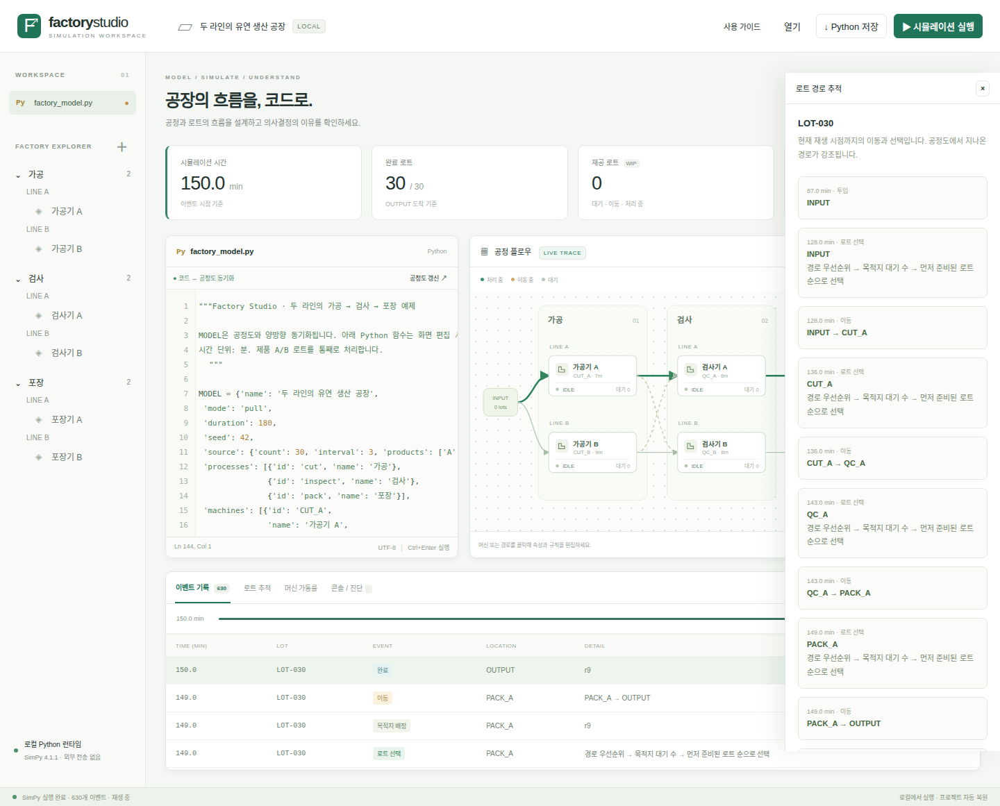

# Factory Studio

**SimPy 기반 공장 시뮬레이션을 코드와 공정도로 함께 설계하는 로컬 웹 IDE.**

시뮬레이터 개발자는 Python 로직을 작성하고, 제조 플래너는 공정·라인·머신과 로트 이동 규칙을 화면에서 편집합니다. 실제 SimPy 실행 기록에서 **어떤 로트가 어디로 이동했으며 왜 선택되었는지** 확인할 수 있습니다.



## 실행

Python **3.10 이상**이 필요합니다. Node.js나 프론트엔드 빌드 도구는 필요하지 않습니다.

```bash
git clone https://github.com/yunsalmon/factory-ide.git
cd factory-ide
./run.sh
```

브라우저에서 **http://127.0.0.1:8765** 를 엽니다. 첫 실행은 가상환경 생성과 SimPy 설치를 수행합니다. 이후에는 네트워크 없이 실행할 수 있습니다. 다른 포트는 `./run.sh --port 9000`으로 지정합니다.

Debian/Ubuntu에서 가상환경 생성이 실패하면 `sudo apt install python3-venv` 후 다시 실행하세요.

직접 설치하거나 Windows에서 실행하려면:

```bash
python -m venv .venv
# macOS / Linux
.venv/bin/python -m pip install -r requirements.txt
.venv/bin/python server.py
# Windows PowerShell에서는 .venv\Scripts\python.exe 를 사용합니다.
```

Python 파일은 현재 사용자 권한으로 실행됩니다. **신뢰하는 로컬 프로젝트를 실행하는 도구**이며, 임의의 외부 사용자 코드를 안전하게 실행하는 멀티테넌트 서비스는 아닙니다. 서버는 기본적으로 `127.0.0.1`에 바인딩합니다.

다른 컴퓨터에서 접속하려면 서버의 LAN IPv4 주소를 명시합니다. 예를 들어:

```bash
./run.sh --host 192.168.1.27
```

접속 주소는 **http://192.168.1.27:8765** 입니다. 지정한 주소는 동일 출처 검사에도 반영됩니다. 별도 로그인 기능은 없으므로 접속 가능한 사용자를 신뢰하는 네트워크에서 사용하세요.

## 작업 흐름

1. **설계:** 공정 탐색기에서 공정을 추가하고, 공정도에서 머신·경로를 추가하거나 클릭해 편집합니다. 머신의 공정·라인, 처리 시간, 경로 우선순위·제품 조건·이동 시간을 설정합니다.
2. **프로그래밍:** Python `MODEL` 선언부가 공정도와 양방향 동기화됩니다. 사용자 정의 함수와 선언부 바깥의 코드는 보존됩니다. 문법 오류가 있으면 마지막 유효 공정도를 유지하고, 화면 편집으로 잘못된 코드를 덮어쓰지 않습니다.
3. **실행:** 실행 버튼 또는 `Ctrl+Enter`. SimPy는 별도 Python 프로세스에서 실행되며, 중지 버튼은 해당 실행 프로세스를 종료합니다.
4. **관찰:** 재생·일시정지·다음 이벤트·타임라인으로 실행 기록을 탐색합니다. ‘선택마다 멈춤’으로 각 의사결정을 확인합니다.
5. **이해:** 이벤트를 선택하면 후보 로트·경로, 우선순위, 당시 대기 수, 제외 조건, 선택 이유가 표시됩니다. 특정 로트를 선택하면 이동 이력과 경로가 강조됩니다.
6. **저장:** `Ctrl+S`로 Python 프로젝트를 내려받고 ‘열기’로 복원합니다. 소스는 브라우저 localStorage에도 자동 저장됩니다. ‘기록’ 버튼은 실행 모델·이벤트·요약을 JSON으로 내보냅니다.

함께 보기 / 플래너 / 개발자 화면을 전환할 수 있습니다. CodeMirror 편집기는 Python 문법 강조, 자동 들여쓰기, 괄호 대응, 실행 취소/다시 실행, 검색/치환을 지원합니다. `Tab`/`Shift+Tab`은 소스를 바꾸지 않고 다음/이전 UI로 이동합니다. 편집기 앞의 ‘결과로 건너뛰기’ 버튼은 첫 결과 탭에 초점을 옮깁니다. 들여쓰기/내어쓰기는 `Ctrl+]`/`Ctrl+[` (macOS `Cmd+]`/`Cmd+[`)로 실행하며 기본 textarea에서도 지원합니다. `Ctrl+Space`는 주요 이름의 기본 완성 목록, `Ctrl+/`는 주석 전환입니다. macOS에서는 저장·실행에 `Cmd`도 사용할 수 있습니다. 완성은 정적 목록이며 Python 언어 서버나 타입 검사기는 아닙니다.

## 모델 의미

| 개념 | 구현 |
| --- | --- |
| 공정 → 라인 → 머신 | 공정 ID와 라인 이름으로 머신을 그룹화합니다. |
| 직렬 / 병렬 머신 | 머신 사이의 명시적 방향 경로로 정의합니다. 공정 순서만으로 자동 연결하지 않습니다. |
| 로트 | 제품을 가진 하나의 이동·처리 단위입니다. 한 머신은 한 번에 한 로트를 처리합니다. |
| Pull | 목적지 머신이 비었을 때, 연결된 출발 위치에 준비된 로트 중 하나를 선택합니다. |
| Push | 로트가 준비되면 목적지 경로를 먼저 선택합니다. 목적지 머신은 배정된 로트를 FIFO로 처리합니다. |
| 기본 선택 규칙 | 낮은 경로 우선순위 → 적은 목적지 배정/점유 수 → 먼저 준비된 로트 → 안정적인 후보 ID 순서입니다. |
| 동일 라인 우선 | 동일 라인 경로의 priority를 낮게 설정합니다. 예제에서 동일 라인은 0, 교차 라인은 10입니다. |
| 제품 필터 | 경로의 product가 로트 제품과 같거나 `*`일 때 통과합니다. 비활성 경로는 제외됩니다. |
| 시간 | 모든 모델 시간은 분입니다. 이동 시간과 처리 시간이 별도로 누적됩니다. |
| 대기 공간 | 머신의 출력 대기 공간은 무제한입니다. 이동 중 목적지 머신을 예약합니다. |
| 시드 | 기본 엔진은 결정적이며 사용자 난수에는 context의 Random 인스턴스를 제공합니다. |

Pull에서 ‘동일 라인 우선’은 **현재 목적지 머신이 선택할 수 있는 준비된 로트** 사이의 우선순위입니다. 다른 머신을 위한 전역 최적화나 미래 로트 대기를 의미하지 않습니다. 동시에 빈 머신의 선택 순서는 `machines` 선언 순서에 따라 결정됩니다.

출고 경로(`to='OUTPUT'`)가 있는 위치에서는 로트가 다음 경로를 선택하고, OUTPUT을 선택한 경우 이동 시간이 지난 뒤 완료됩니다. 경로가 없거나 제품 조건이 맞지 않으면 `blocked` 기록을 남깁니다. 종료 시점에 미완료 로트가 있으면 진단에서 알립니다.

## Python ↔ 공정도 계약

최상위에 **하나의 `MODEL = {...}` 리터럴 딕셔너리**를 둡니다. `model.py`가 AST로 값을 읽고, 화면에서 수정할 때 그 값의 소스 범위만 교체합니다. 분석 단계에서는 Python을 실행하지 않습니다. 선언부 내부의 서식·주석은 재작성되므로 보존할 설명은 선언부 밖에 두세요. 실행 중 `MODEL`을 변경하면 오류를 반환합니다.

임의의 Python 제어 흐름 전체를 역공학하는 방식이 아닙니다. 구조는 선언부에서, 상세 동작은 함수에서 정의합니다. 이 경계 덕분에 LLM 없이 양방향 편집 결과가 결정적입니다.

### 선택 함수

```python
def choose_candidate(candidates, context):
    chosen = min(candidates, key=lambda c: (
        c['priority'], c['ready_since'], c['id']
    ))
    return chosen['id'], '경로 우선순위와 FIFO에 따라 선택'
```

후보에는 `id`, `lot_id`, `route_id`, `from`, `to`, `product`, `priority`, `ready_since`, `queue_length`, `same_line`이 있습니다. `context`에는 `now`, `mode`, `rng`, 그리고 Pull의 `machine` 또는 Push/출고 선택의 `lot`이 있습니다. 반드시 전달받은 후보 ID 하나와 비어 있지 않은 설명을 반환합니다.

연결·활성화·제품 조건을 통과한 후보만 함수로 전달되며, 제외 사유도 실행 기록에 남습니다. 선택되지 않은 유효 후보에 대해서는 임의의 이유를 추론하지 않고 ‘선택 함수가 선택하지 않음’으로 표시합니다.

### 처리 시간과 직접 SimPy 프로그래밍

```python
def processing_time(machine, lot, context):
    return machine['time'] + context['rng'].uniform(0, 1)
```

복잡한 처리에는 선택적으로 `process_lot` 제너레이터를 정의합니다. 이 경우 `processing_time`을 대신합니다.

```python
import simpy

def process_lot(env, machine, lot, context):
    # 실행 전체에서 공유되는 작업자 자원
    if 'operator' not in context['shared']:
        context['shared']['operator'] = simpy.Resource(env, capacity=1)
    with context['shared']['operator'].request() as request:
        yield request
        yield env.timeout(1)  # 준비
        yield env.timeout(machine['time'])
```

머신·로트 인자는 사본입니다. 함수에서 변경해도 엔진의 로트 위치나 구조는 바뀌지 않습니다. `context['shared']`는 실행별 공유 객체 저장소입니다. 사용자 프로세스 내부 이벤트는 공정도에 자동으로 세분화되지 않으며, 바깥의 처리 시작/종료로 기록됩니다. 가동률은 그 사이의 전체 시간으로 계산하므로 사용자 프로세스 내부의 자원 대기도 포함합니다.

## 실행과 재생의 범위

- 실행은 실제 SimPy 이산 이벤트 시뮬레이션입니다. 완료된 기록을 프론트엔드가 재생합니다. 재생 속도는 이벤트 수 기준이며 실제 시간 배속이 아닙니다.
- 중지 버튼은 계산 프로세스를 중지합니다. 재생 일시정지와 ‘선택마다 멈춤’은 **기록 재생 제어**이며 Python 줄 단위 디버거는 아닙니다.
- KPI는 현재 재생 이벤트 시점 기준입니다. 평균 리드타임은 완료 로트만 포함합니다. 마지막 이벤트가 실행 기간보다 빨리 끝날 수 있습니다.
- 로트 분할·병합·배치 처리, 유한 버퍼와 blocking/starvation의 상세 모델, 장애·정비 편집 UI, LLM, 다중 사용자 협업은 포함하지 않습니다.
- 로컬 실행 한도: 머신 100대, 경로 500개, 로트 2,000개, 기록 50,000개, 요청 소스 1 MB, 실제 실행 20초입니다. Linux/macOS worker는 메모리 768 MiB와 CPU 15초 제한도 적용합니다. 한도는 안전한 격리나 최대 규모의 성능 보장을 의미하지 않습니다.
- Python은 작업 디렉터리의 파일과 네트워크에 접근할 수 있습니다. 서버 자체에 외부 분석·LLM·원격 저장 호출은 없습니다.

## 검증

엔진, 동기화, API 및 브라우저 JavaScript WIP 집계 테스트:

```bash
.venv/bin/python -m pip install -r requirements-dev.txt
.venv/bin/python -m playwright install chromium
.venv/bin/python -m unittest discover -s tests -v
```

실제 Chromium을 통한 양방향 편집·실행·저장·중지·모바일 화면 테스트:

```bash
.venv/bin/python -m pip install -r requirements-dev.txt
.venv/bin/python -m playwright install chromium
.venv/bin/python tests/browser_smoke.py
.venv/bin/python tests/browser_inventory.py
```

브라우저 테스트는 임시 포트의 서버를 자체 실행합니다. Linux에서 브라우저 시스템 라이브러리가 없으면 `python -m playwright install --with-deps chromium`을 사용하세요. 테스트 스크린샷은 `artifacts/`에 저장됩니다. GitHub Actions에서도 동일한 테스트를 실행합니다.

## 구성

```text
server.py         로컬 HTTP API, 실행 worker 관리, 동일 출처 검사
model.py          AST 분석, 모델 검증, 선언부 갱신
engine.py         SimPy 실행, Pull/Push, 후보 및 로트 이벤트 기록
worker.py         사용자 Python 실행, 로그·오류 수집, 자원 제한
web/              프론트엔드와 로컬 CodeMirror 배포본
examples/demo.py  가공 → 검사 → 포장, 두 라인과 교차 경로 예제
tests/            엔진·API·브라우저 검증
```

편집·실행·시각화 작업 흐름은 [Jaspera](https://github.com/JVMLand/Jaspera)에서 영감을 받았습니다. [FactorySimPy](https://github.com/FactorySimPy/FactorySimPy)는 제조 시스템 모델링의 참고 자료로 검토했으며, 이 프로젝트는 **SimPy를 직접 사용한 별도 엔진**입니다. 두 프로젝트의 코드를 복사하거나 런타임 의존성으로 포함하지 않습니다. 번들 라이선스는 [THIRD_PARTY_NOTICES.md](THIRD_PARTY_NOTICES.md)를 참고하세요.

## Public browser sandbox

The static public build edits and runs Python/SimPy inside a disposable browser Web Worker.
It has no server execution API and retains the versioned example as the initial/reset fallback.
Korean, English and Japanese builds support run, stop, timeout, diagnostics, import/download,
and schema-v2 result export with source and runtime metadata.
See [public demo deployment and recovery](docs/public-demo.md) for isolated build/testing,
container operation and the proposed `factory.yshnote.com` ingress plan. This repository
change alone does not establish that the external HTTPS deployment is live or accepted.

## WIP 현황판

실행 후 **WIP 현황판** 탭에서 현재 재생 이벤트까지의 로트를 공정·라인·위치별로 확인합니다. 최종 상태 보기는 재생 커서와 별도로 표시합니다. 필터·검색, 그룹/로트 선택에 따른 공정도 강조, 커서까지의 이력과 선택 이유, 표시 로트 CSV 내보내기를 지원합니다. 수량·출하 지시 시각이 모델에 없으면 값을 만들지 않습니다. 현재 추정 대기열과 향후 명시적 버퍼를 연결하는 계약 및 집계 기준은 [WIP projection](docs/inventory-projection.md)에 설명합니다.
### Order planning

The **Order planner** tab adds optional order quantities, split lots, scheduled releases,
business priority and due-date tracking without changing legacy generated supply.
Try `examples/orders_demo.py`; use the tab's JSON plan editor/import/export and filtered CSV.
See [order schema, replay metrics and dispatch contract](docs/orders.md) for time/date
semantics, finite INPUT admission, localized validation and tests.

Planner scenario comparison: run and save named snapshots, compare signed final-horizon KPIs, inspect paired trace evidence, and export/restore without rerunning. See [scenario contract and metric definitions](docs/scenario-comparison.md).

Repeated browser experiments support explicit seed sets, bounded concurrency, cancellation, KPI uncertainty and portable artifacts. See [experiment contracts and local runtime setup](docs/experiments.md).

Cold browser-runtime delivery and the five-context local/public release gate are documented in [docs/runtime-delivery.md](docs/runtime-delivery.md).
The public page's retained interactive runtime, zero-settled task rules, and
repeatable Worker/heap/RSS gate are documented in
[docs/worker-resources.md](docs/worker-resources.md).
